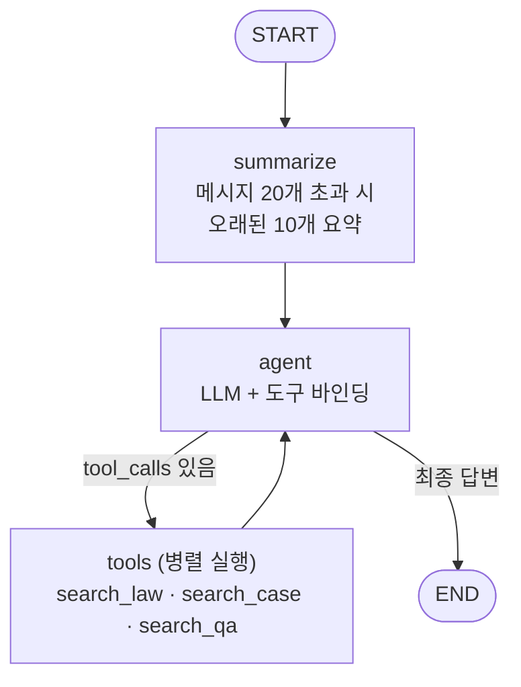

# 생활법률 RAG 챗봇

법조문 · 대법원 판례 · 생활법령 상담 자료를 근거로 답변하는 법률 Q&A 어시스턴트입니다.
사용자가 변호사를 만나기 전에 스스로 상황을 이해하고 무엇을 준비해야 할지 파악할 수 있도록,
**출처가 명시된 구체적인 답변**을 제공하는 것을 목표로 합니다.

일반적인 법률 챗봇과의 차이는 답변의 근거를 실제 원문에서 가져온다는 점입니다.
국가법령정보센터 API로 수집한 현행 법조문 5,390청크와 2020년 이후 대법원 판례 3,138건,
법제처 생활법령 21,610청크를 벡터DB에 적재하고, 에이전트가 질문 성격에 맞는 도구를 골라 검색합니다.

---

## 목차

- [주요 기능](#주요-기능)
- [아키텍처](#아키텍처)
- [데이터 구성](#데이터-구성)
- [기술 스택](#기술-스택)
- [프로젝트 구조](#프로젝트-구조)
- [실행 방법](#실행-방법)
- [데이터 파이프라인](#데이터-파이프라인)
- [평가](#평가)
- [배포](#배포)
- [설계 기록](#설계-기록)
- [알려진 이슈](#알려진-이슈)

---

## 주요 기능

- **다중 소스 RAG 검색** — 법조문(`search_law`), 대법원 판례(`search_case`), 생활법령 상담(`search_qa`) 세 도구를 제공하고 LLM이 질문에 맞게 조합. 한 턴에 여러 도구를 병렬 호출한다.
- **분야별 필터링** — 형사/임대차/노동/교통/민사 5개 도메인으로 검색 범위 축소
- **출처 인용** — 답변에 조문 번호(`도로교통법 제148조의2`)와 사건번호(`2022도3792`)를 원문 그대로 표기
- **멀티턴 대화 + 자동 요약** — `thread_id` 기반 이력 유지, 메시지 20개 초과 시 오래된 대화를 요약해 컨텍스트 관리
- **토큰 단위 스트리밍** — SSE로 실시간 응답. 내부 도구 호출·요약 과정은 사용자에게 노출되지 않음
- **사용자 인증 & 대화 관리** — bcrypt 해시 + 토큰 인증, 사용자별 대화 목록/이력/삭제, 소유권 검증
- **증분 임베딩** — manifest 기반으로 변경된 법령·신규 판례만 재수집

---

## 아키텍처



[app/graph.py](app/graph.py)는 LangGraph 기반이며 3가지 variant를 지원합니다.

| variant | 구조 | 설명 |
|---|---|---|
| **`single`** (운영 중) | 라우팅 없음 | 단일 에이전트가 3개 도구를 모두 사용 |
| `current` | supervisor 라우팅 | research(법조문·판례) / counsel(생활법령)로 분기, 도구 배타적 |
| `shared` | supervisor 라우팅 | counsel에도 법조문·판례 도구 공유 |

LangSmith 평가로 세 구조를 비교한 뒤 `single`을 채택했습니다. 케이스가 2종류뿐인 상황에서 라우팅 오분류 위험이 이득보다 컸고, 단일 에이전트가 필요한 도구를 스스로 조합하는 편이 정확했습니다.

### 요청 처리 흐름

```
POST /api/query/stream
  → 소유권 검증 (남의 thread 접근 차단)
  → 대화 메타 upsert (첫 질문을 제목으로)
  → astream_events 로 그래프 실행
      · summarize 노드 출력은 필터링 (내부용)
      · 도구 호출 턴의 텍스트는 reset 이벤트로 폐기
      · 최종 답변 토큰만 SSE 전송
  → [DONE]
```

`recursion_limit`(기본 16)을 하드 상한으로 두고, 프롬프트로 도구 호출을 4회까지 제한합니다. 상한 초과 시 원시 예외 대신 안내 문구를 반환합니다.

---

## 데이터 구성

### 법령 · 판례 (`var/chroma_persist`, 35,210청크)

국가법령정보센터 Open API로 수집합니다.

| 도메인 | 법령 청크 | 판례 |
|---|---:|---:|
| criminal (형사) | 1,691 | 919 |
| civil (민사) | 2,747 | 1,965 |
| labor (노동) | 489 | 283 |
| traffic (교통) | 381 | 108 |
| housing (임대차) | 82 | 61 |
| **합계** | **5,390** | **3,138건 / 29,820청크** |

- 법령 29개(중복 포함), 조문 단위로 분할해 적재
- 판례는 대법원 선고분만, 기간 `2020.01.09 ~ 2026.05.29`
- 판례 198건은 두 개 이상 도메인에 속함 (예: 특정범죄가중법 → criminal + traffic)

### 생활법령 (`var/chroma_qa`, 21,610청크)

법제처 "찾기쉬운 생활법령" 책자형 PDF 280건을 섹션 단위로 파싱해 적재합니다. 18개 대분류로 필터링할 수 있습니다.

### 임베딩

`jhgan/ko-sroberta-multitask` — 한국어 특화 문장 임베딩 모델. 법령/판례와 생활법령을 **별도 컬렉션**으로 분리해 상담 검색이 법조문 검색에 섞이지 않도록 했습니다.

---

## 기술 스택

| 영역 | 사용 기술 |
|---|---|
| LLM | Claude (Anthropic) / Gemini 선택 가능 |
| Agent | LangGraph (StateGraph, ToolNode, AsyncSqliteSaver) |
| Vector DB | Chroma + `jhgan/ko-sroberta-multitask` |
| API | FastAPI, SSE 스트리밍 |
| 저장소 | SQLite (사용자·대화 메타 / LangGraph 체크포인트) |
| 평가 | LangSmith (LLM-judge + 규칙 기반 평가자) |
| 배포 | Docker, GitHub Actions → GHCR → EC2 |

---

## 프로젝트 구조

```
online_law/
├── app/                      # 서비스 코드
│   ├── main.py               #   API 엔드포인트, 인증, SSE 스트리밍
│   ├── graph.py              #   LangGraph 정의, 프롬프트, LLM 설정
│   ├── db.py                 #   사용자 인증 · 대화 목록 (SQLite)
│   ├── law_api.py            #   국가법령정보센터 API 클라이언트 (페이징·재시도)
│   ├── vectordb.py           #   법령/판례 벡터DB 구축·로드
│   └── counsel_tools.py      #   생활법령 검색 도구
├── scripts/                  # 데이터 파이프라인 (로컬 1회성)
│   ├── download.py           #   생활법령 PDF 다운로드
│   ├── parse_pdfs.py         #   PDF → 섹션 단위 JSON
│   ├── build_qa_vectordb.py  #   생활법령 벡터DB 적재
│   └── check_law_names.py    #   법령명 검증 유틸
├── eval/                     # LangSmith 평가
│   ├── eval_dataset_single.json   #   single agent 평가 10문항
│   ├── eval_dataset.json          #   3-variant 비교용 16문항
│   ├── eval_evaluators.py         #   tool_usage / tool_precision / LLM-judge
│   ├── eval_targets.py            #   variant별 실행 target
│   ├── upload_dataset_single.py   #   데이터셋 업로드 (중복 제거)
│   ├── run_eval_single.py         #   single 단독 평가 (3회 반복)
│   └── run_eval.py                #   variant 3종 비교
├── data/                     # 원본·중간 산출물 (git 미포함)
├── static/index.html         # 프론트엔드 (단일 파일)
└── var/                      # 런타임 상태 (git 미포함, EC2 볼륨 마운트)
```

---

## 실행 방법

```bash
uv sync
uv run uvicorn app.main:app --reload
```

### 환경 변수 (`.env`)

| 변수 | 기본값 | 설명 |
|---|---|---|
| `ANTHROPIC_API_KEY` | — | 필수 (Claude 사용 시) |
| `ANTHROPIC_MODEL` | `claude-sonnet-4-6` | 운영은 `claude-sonnet-5` |
| `LLM_PROVIDER` | `anthropic` | `google`로 바꾸면 Gemini 사용 |
| `LLM_TEMPERATURE` | `0` | 법률 답변 일관성을 위해 0 고정. Sonnet 5 이후 세대는 비기본값을 거부하므로 자동으로 미적용 |
| `LLM_EFFORT` | (미지정) | `low`/`medium`/`high` — Sonnet 5 이후 세대만 적용 |
| `LAW_API_OC` | — | 국가법령정보센터 Open API 인증키 |
| `GRAPH_RECURSION_LIMIT` | `16` | 도구 루프 하드 상한 |
| `CHROMA_PERSIST_DIR` | `./var/chroma_persist` | 법령/판례 벡터DB |
| `LANGSMITH_API_KEY` | — | 평가 시 필요 |

벡터DB가 없다면 먼저 구축해야 합니다.

```bash
uv run python -m app.vectordb            # 법령 + 판례 (전체 30분 내외)
uv run python -m app.vectordb --domain housing labor   # 특정 도메인만
uv run python scripts/build_qa_vectordb.py             # 생활법령
```

---

## 데이터 파이프라인

```
[생활법령]  csm_catalog.json
              → download.py        PDF 280건 다운로드
              → parse_pdfs.py      섹션 단위 파싱 → data/qa_documents.json
              → build_qa_vectordb.py → var/chroma_qa (21,610청크)

[법령·판례] 국가법령정보센터 API
              → app/vectordb.py    조문/판례 수집·임베딩 → var/chroma_persist
                 · manifest로 변경분만 갱신
                 · 법령: 조문번호 + 가지번호로 식별 (제148조의2)
                 · 판례: 참조법령(JO) + 기간으로 검색, 대법원만 필터
```

수집 시 고려한 것들입니다.

- **페이징** — `display` 상한이 100이라 형법(156건)·민법(285건) 등은 한 번에 못 받습니다. `totalCnt`를 보고 끝까지 페이징합니다.
- **재시도** — law.go.kr이 부하 시 정상 요청에도 간헐적으로 404를 반환합니다. 404/429/5xx는 지수 백오프로 재시도하고 그 외 4xx는 즉시 실패시킵니다.
- **배치 적재** — Chroma의 1회 적재 상한이 5,461건이라 민법 판례(10,987청크) 같은 경우 나눠서 넣습니다.
- **중단 복구** — manifest를 법령 단위로 저장해, 중간에 실패해도 재실행 시 중복 적재가 없습니다.

---

## 평가

LangSmith 기반으로 3개 지표를 측정합니다.

| 평가자 | 측정 대상 |
|---|---|
| `tool_usage` | 기대 도구를 실제로 호출했는가 (recall) |
| `tool_precision` | 불필요한 도구까지 부르지 않았는가 (precision) |
| `answer_quality` | LLM-judge — 정확성·충실성·실용성·명료성 (0~100 정규화) |

```bash
uv run python eval/upload_dataset_single.py   # 데이터셋 업로드 (최초 1회)
uv run python eval/run_eval_single.py         # 3회 반복 평가
```

### 데이터셋 (10문항)

5개 도메인을 모두 커버하고, **단일 도구만 써야 정답인 문항**(출생신고 → `search_qa`만)을 섞어 과잉 검색이 드러나도록 구성했습니다. 도구 분포는 `search_law` 9 / `search_qa` 7 / `search_case` 3입니다.

### 현재 성능 (문항당 3회 반복)

운영 구성(`claude-sonnet-5` + `effort=low`) 기준입니다.

| 지표 | Haiku 4.5 | Sonnet 5 | **Sonnet 5 + low** |
|---|---:|---:|---:|
| tool_usage (recall) | 1.000 | 1.000 | **1.000** |
| tool_precision | 0.917 | 0.663 | **0.696** |
| answer_quality | 0.787 | 0.915 | **0.903** |
| latency (로컬) | 9.5s | 33.3s | **20.5s** |

모델 교체가 가장 큰 폭의 개선이었습니다. 검색 인프라 개선(판례 29배 확대, 조문 인용 수정)이 0.756 → 0.787이었던 반면, 모델 교체만으로 0.787 → 0.915가 되었습니다. `effort=low`는 품질 손실이 측정 편차(0.056) 안쪽인 반면 지연을 38% 줄여 채택했습니다.

`tool_precision` 하락은 Sonnet 5가 도구를 더 많이 호출하기 때문입니다. recall이 1.000이고 품질이 전 문항 상승했으므로 과잉 검색이 결과를 해치지는 않으며, 데이터셋의 `expected_tools`가 최소 집합 기준이라는 측면도 있습니다.

문항 내 편차는 평균 0.062, 문항 간 표준편차는 0.127입니다. **품질을 좌우하는 것은 실행 편차가 아니라 문항 자체**이며, 개선 효과를 판단하려면 반복 측정이 필수입니다.

> 문항당 1회 실행으로는 실행 편차와 실제 개선을 구분할 수 없습니다. 개선 전후를 비교할 때는 반드시 `NUM_REPETITIONS`를 유지하세요.

---

## 배포

`main` 브랜치 푸시 시 GitHub Actions가 Docker 이미지를 빌드해 GHCR에 올리고, EC2에 SSH로 접속해 컨테이너를 재기동합니다.

```
push → build → GHCR → EC2 (stop → rm → prune → pull → run)
```

### 볼륨 구조

`var/` 하위 런타임 상태는 이미지에 포함되지 않고 **EC2 호스트 볼륨으로 마운트**됩니다.

| 호스트 | 컨테이너 |
|---|---|
| `/home/ubuntu/chroma_data/chroma_persist` | `/app/var/chroma_persist` |
| `/home/ubuntu/chroma_data/chroma_qa` | `/app/var/chroma_qa` |
| `/home/ubuntu/app_data/users.db` | `/app/var/users.db` |
| `/home/ubuntu/app_data/checkpoints.db` | `/app/var/checkpoints.db` |

### 벡터DB 갱신은 배포와 별개입니다

**재배포만으로는 새 벡터DB가 반영되지 않습니다.** 로컬에서 재구축한 뒤 직접 전송해야 합니다.

```bash
ssh -i <key.pem> ubuntu@<host> "docker stop online-law"

rsync -avz --delete --partial --progress -e "ssh -i <key.pem>" \
  var/chroma_persist/ ubuntu@<host>:/home/ubuntu/chroma_data/chroma_persist/

ssh -i <key.pem> ubuntu@<host> "docker start online-law"
```

`--delete`가 필요한 이유는 Chroma가 컬렉션마다 UUID 폴더를 만들기 때문입니다. 이전 폴더가 남으면 `chroma.sqlite3`가 참조하지 않는 고아 파일이 됩니다.

---

## 설계 기록

주요 문제와 해결 과정입니다.

### 답변 일관성 — `temperature` 기본값 함정

`temperature`를 지정하지 않으면 Anthropic 기본값 **1.0**이 적용됩니다. 법률 답변에 최대 무작위성 설정이 걸려 있던 셈으로, 동일 질문 3회 실행에서 품질 점수가 0.24~0.30 범위로 흔들렸습니다.

`temperature=0`으로 내렸더니 한 문항은 편차가 0.30 → 0.02로 떨어졌지만 다른 문항은 그대로였습니다. 추적해 보니 **검색어 자체가 실행마다 달랐습니다** — 유류분 질문인데 검색어에 "유류분"이 빠지는 식이었습니다. 프롬프트에 "질문의 법률 쟁점을 가리키는 용어를 반드시 검색어에 넣으라"는 지침을 추가하고 나서야 도구 호출이 실행 간 완전히 일치했습니다.

**두 가지를 함께 적용해야 효과가 났습니다.**

### 조문 가지번호 누락 (590건 이상)

국가법령정보센터 API는 개정으로 추가된 조문을 `조문번호`와 `조문가지번호`로 나눠서 줍니다.

```
조문번호=148, 가지번호=None → 제148조
조문번호=148, 가지번호=2    → 제148조의2
조문번호=148, 가지번호=3    → 제148조의3
```

`조문번호`만 읽고 있어서 셋 다 "제148조"로 저장됐습니다. 음주운전 처벌을 물으면 실제 근거인 제148조의2 대신 엉뚱한 조문이 출처로 붙었습니다. 형사소송법 117건, 민법 75건, 도로교통법 48건 등 **최소 590개 조문**이 영향을 받았고, `민법 제959조` 하나에 제959조의2~의20까지 20개 조문이 뭉쳐 있었습니다.

가지번호를 반영하도록 고치면서, 법령이 개정되지 않으면 `mst:efYd`가 그대로라 재임베딩이 스킵되는 문제가 있어 `LAW_SCHEMA_VERSION`을 manifest 키에 포함시켰습니다.

### 내부 진행 상황 노출

세 가지가 사용자 답변에 섞이고 있었습니다.

1. **요약 노드 출력** — `astream_events`가 노드 구분 없이 모든 LLM 토큰을 내보내, 대화가 20개를 넘어 요약이 도는 순간 요약문이 답변 앞에 찍혔습니다.
2. **도구 호출 턴의 텍스트** — "검색하겠습니다" 류가 그대로 노출됐습니다.
3. **최종 답변의 프리앰블** — "완벽합니다. 이제 답변드리겠습니다."

1·2는 노드 필터와 `reset` 이벤트로, 3은 프롬프트로 해결했습니다. 3은 프롬프트를 두 번 고쳐야 잡혔는데, 처음엔 "도구 호출 **전**"만 금지해서 결과 수신 **후**의 코멘트가 안 걸렸기 때문입니다.

### 판례 커버리지

초기 수집 기간이 2026년 상반기뿐이라 판례가 107건, traffic 도메인은 **1건**이었습니다. `search_case`가 사실상 동작하지 않는 상태였습니다.

2020년부터로 확대해 3,138건이 됐고(traffic 108건, housing 61건), 평가에서 처음으로 답변에 실제 사건번호(`2022도3792`, `2020도15812`)가 인용되기 시작했습니다.

### 관련 없는 판례가 결론을 흐리는 문제

판례를 늘리자 새 문제가 생겼습니다. 음주운전 처벌 질문에서 위헌결정 관련 판례를 끌어와 "법적 상황이 복잡하다"로 답을 흐리면서, 정작 조문이 정한 형량과 면허 결격기간을 빠뜨렸습니다.

"검색된 판례가 쟁점과 무관하면 버리고, 조문이 법정형을 명확히 정한 경우 그 내용을 먼저 답하라"는 지침으로 해당 문항이 0.443 → 0.657로 올랐습니다.

### 측정 방법에 대한 교훈

프롬프트 수정을 4번 반복했는데, 초기 2번은 오히려 나빠졌습니다. 도구 지침 문장에서 `search_case`를 실수로 삭제했고, 새로 만든 `[절차 안내]` 섹션이 모델을 `search_qa` 쪽으로 기울였습니다.

**7문항 단발 실행으로 도구 선택만 먼저 확인**하는 사전 점검을 넣고 나서야 회귀를 사전에 걸러낼 수 있었습니다. 전체 평가는 비용과 시간이 들기 때문에, 값싼 점검을 앞에 두는 편이 효율적이었습니다.

---

## 알려진 이슈

### 판례 검색 쏠림

`search_case`가 k=3으로 뽑을 때 한 판례에서 여러 청크가 나올 수 있습니다. 판례당 평균 9.5청크이고 **최대 167청크**인 사건이 있어, "판례 3개 뽑아줘" 같은 질문에서 한 사건만 나올 수 있습니다.

판례별 1청크만 허용하는 후처리로 완화 가능합니다.

### EC2 메모리 부족으로 인한 검색 지연

2GB 인스턴스에서 판례 벡터 인덱스가 메모리에 올라가지 않아 디스크에서 읽습니다.

| 구간 | 로컬 | EC2 | 배율 |
|---|---:|---:|---:|
| 임베딩 1회 | 15ms | 96ms | 6배 |
| 검색 (법령 5,390청크) | 27ms | 196ms | 7배 |
| 검색 (판례 29,820청크) | 90ms | **3,642ms** | **40배** |

법령은 7배인데 판례만 40배라는 점이 메모리 병목의 근거입니다. `search_case`를 호출하는 질문만 체감상 느립니다.

인스턴스를 4GB로 올리면 해소될 것으로 보입니다. 판례 본문을 줄이는 방안도 검토했으나, **판결요지가 비어 있는 판례가 91%**이고 검색 히트의 87%가 전문(全文)에서 나와 적용하지 않았습니다.

### 답변 품질이 검색 개선을 따라오지 못함

판례를 107건 → 3,138건으로 29배 늘리고 조문 인용 정확성을 고쳤는데도 `answer_quality`는 0.756 → 0.787로 소폭 상승에 그쳤습니다. 도구 선택(recall 1.000)과 근거 정확성은 확보됐으므로, 남은 병목은 **확보된 자료로 답을 구성하는 모델의 능력**이라고 판단했습니다.

`claude-haiku-4-5` → `claude-sonnet-5` 교체로 이 가설이 확인되었습니다. **10문항 전부 품질이 올라** 0.787 → 0.915가 되었습니다. 검색 인프라를 아무리 개선해도 모델이 자료를 활용하지 못하면 한계가 있다는 것이 이번 프로젝트에서 가장 분명하게 확인된 사실입니다.

교체 시 API 차이 두 가지를 처리해야 했습니다. Sonnet 5 이후 세대는 **비기본값 `temperature`를 400으로 거부**하고, **thinking이 기본으로 켜지면서** 응답에 실린 빈 thinking 블록을 도구 루프에서 되돌려 보낼 때 `thinking.thinking: Field required` 400이 납니다. `build_llm`에서 모델별로 분기해 해결했습니다.

### LLM-judge의 한계

judge가 조문 번호나 형량 수치의 오류를 안정적으로 잡아내지 못합니다. 실제로 "2년 이상 6년 이하"(정답: 5년 이하)라는 틀린 수치가 포함된 답변이 0.72점을 받았습니다. judge 자체의 채점 편차는 σ=0.015로 매우 안정적이므로, 문제는 일관성이 아니라 채점 기준입니다.

judge 프롬프트에 "조문 번호·형량이 검색 결과와 일치하는지" 확인 항목을 넣는 것이 개선 방향입니다.

### 기타

- 국가법령정보센터 API 기반 임베딩 결과와 실제 최신 법령 간 정합성 주기적 점검 필요
- 멀티턴 대화는 평가 데이터셋에서 제외되어 있음 (평가 시 checkpointer 미사용)
