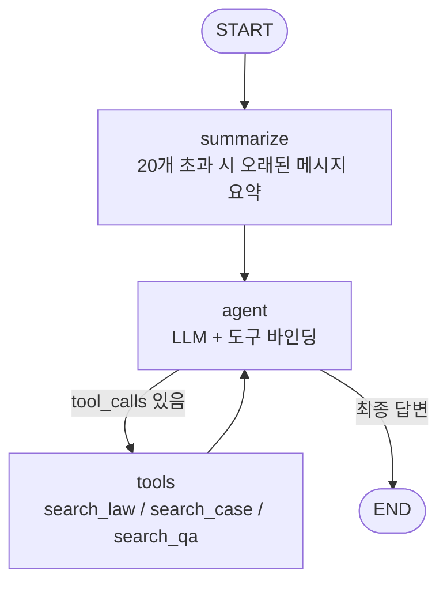

# 생활법률 RAG 챗봇

법조문 · 판례 · 생활법령 상담 자료를 근거로 답변하는 법률 Q&A 어시스턴트입니다.
사용자가 변호사를 만나기 전에 스스로 상황을 이해하고 무엇을 준비해야 할지 파악할 수 있도록,
근거 자료 기반의 구체적인 답변을 제공하는 것을 목표로 합니다.

## 주요 기능

- **다중 소스 RAG 검색**: 법조문(`search_law`), 대법원 판례(`search_case`), 생활법령 상담 자료(`search_qa`) 세 가지 벡터DB를 도구로 제공하고, LLM이 질문 성격에 맞게 조합해 검색
- **분야별 필터링**: 형사/임대차/노동/교통/민사 등 도메인으로 검색 범위를 좁혀 정확도 향상
- **멀티턴 대화 + 자동 요약**: `thread_id` 기반 대화 이력 유지, 메시지가 20개를 넘으면 오래된 대화를 요약해 컨텍스트 길이 관리
- **실시간 스트리밍 응답**: SSE(Server-Sent Events)로 토큰 단위 스트리밍
- **사용자 인증 & 대화 관리**: 회원가입/로그인(bcrypt 해시 + 토큰), 사용자별 대화 목록/이력 조회, 소유권 검증
- **증분 임베딩**: manifest 기반으로 변경된 법령·신규 판례만 재임베딩

## 아키텍처



`app/graph.py`는 LangGraph 기반이며 3가지 variant를 지원합니다.

| variant | 구조 | 설명 |
|---|---|---|
| `single` (기본, 서비스 운영 중) | 라우팅 없음 | 단일 에이전트가 법조문/판례/생활법령 도구를 전부 사용 |
| `current` | supervisor 라우팅 | research(법조문/판례) / counsel(생활법령) 에이전트로 분기, 도구 배타적 |
| `shared` | supervisor 라우팅 | counsel 에이전트에도 법조문/판례 도구 공유 |

세 variant는 [`eval/`](eval/)의 평가 파이프라인으로 라우팅 정확도·도구 사용 적절성·답변 품질을 비교해 최적 구조를 선택했습니다.

## 기술 스택

- **LLM / Agent**: Claude(Anthropic) / Gemini, LangGraph, LangChain
- **Vector DB**: Chroma, `jhgan/ko-sroberta-multitask` 임베딩
- **API 서버**: FastAPI, SSE 스트리밍, SQLite(대화 체크포인트 · 사용자 DB)
- **평가**: LangSmith (LLM-judge 기반 정량 평가)
- **배포**: Docker, GitHub Actions → GHCR → EC2

## 프로젝트 구조

```
online_law/
├── app/                    # FastAPI 서버 + LangGraph 에이전트 (서비스 코드)
│   ├── main.py             #   API 엔드포인트, 인증, SSE 스트리밍
│   ├── graph.py            #   LangGraph 그래프 정의 (라우팅/에이전트/도구 루프)
│   ├── db.py                #   사용자 인증 · 대화 이력 (SQLite)
│   ├── law_api.py           #   국가법령정보센터 API 클라이언트
│   ├── vectordb.py          #   법령/판례 벡터DB 구축·로드
│   └── counsel_tools.py     #   생활법령 상담 검색 도구
├── scripts/                # 데이터 파이프라인 (로컬 1회성 실행)
│   ├── download.py          #   생활법령 PDF 다운로드
│   ├── parse_pdfs.py        #   PDF -> 섹션 단위 JSON 파싱
│   ├── build_qa_vectordb.py #   파싱 결과를 벡터DB에 적재
│   └── check_law_names.py   #   법령명 검증 유틸
├── eval/                   # LangSmith 기반 정량 평가
│   ├── eval_dataset.json    #   평가 문항
│   ├── eval_evaluators.py   #   라우팅 정확도 / 도구 사용 / LLM-judge 평가자
│   ├── eval_targets.py      #   variant별 실행 target
│   ├── upload_dataset.py    #   LangSmith 데이터셋 업로드
│   └── run_eval.py          #   variant 3종 비교 평가 실행
├── data/                   # 원본/중간 산출 데이터 (pdfs, qa_documents.json 등)
├── static/                 # 프론트엔드 (단일 페이지)
└── var/                    # 런타임 상태: SQLite DB, Chroma 벡터DB (git 미포함)
```

## 데이터 파이프라인

1. `scripts/download.py` — 찾기쉬운 생활법령 책자형 PDF 281건 다운로드
2. `scripts/parse_pdfs.py` — 섹션 단위로 파싱해 `data/qa_documents.json` 생성
3. `scripts/build_qa_vectordb.py` — 파싱 결과를 임베딩해 `var/chroma_qa`에 적재
4. `app/vectordb.py --domain ...` — 국가법령정보센터 API로 법령 본문·대법원 판례를 조회해 `var/chroma_persist`에 적재 (manifest로 변경분만 갱신)

## 실행 방법

```bash
uv sync

# .env 필요 값
# ANTHROPIC_API_KEY / ANTHROPIC_MODEL (또는 GOOGLE_API_KEY / GOOGLE_MODEL, LLM_PROVIDER=google)
# LAW_API_OC (국가법령정보센터 Open API 인증키)
# PASSCODE (선택, 접근 제한용)

uv run uvicorn app.main:app --reload
```

벡터DB가 없다면 먼저 `uv run python -m app.vectordb`(법령/판례)와 `scripts/build_qa_vectordb.py`(생활법령)로 구축해야 합니다.

## 평가

```bash
uv run python eval/upload_dataset.py   # LangSmith에 평가 데이터셋 업로드
uv run python eval/run_eval.py         # single/current/shared 3개 variant 비교 평가
```

라우팅 정확도, 기대 도구 사용률(recall), LLM-judge 기반 답변 품질(정확성·충실성·실용성·명료성)을 기준으로 비교합니다.

## 배포

GitHub Actions가 `main` 브랜치 푸시 시 Docker 이미지를 빌드해 GHCR에 푸시하고, EC2에 SSH로 접속해 컨테이너를 재기동합니다.
`var/` 하위의 SQLite DB와 Chroma 벡터DB는 EC2 호스트 볼륨으로 마운트되어 배포 간에도 유지됩니다.

## 알려진 이슈 / 향후 개선 방향

- **판례 검색 쏠림**: `search_case`가 상위 k개 청크를 뽑을 때, 하나의 판례에서 유사도 높은 청크가 여러 개 나오면 다양한 판례를 보여주지 못하는 문제가 있음 (예: "강도 살인 판례 3개 뽑아줘" 같은 질문에서 발생)
- 케이스가 늘어나면 현재의 단일 에이전트(ReAct) 구조를 멀티 에이전트 구조로 전환 검토
- 국가법령정보센터 API 기반 임베딩 결과와 실제 최신 법령 간 정합성 주기적 점검 필요
